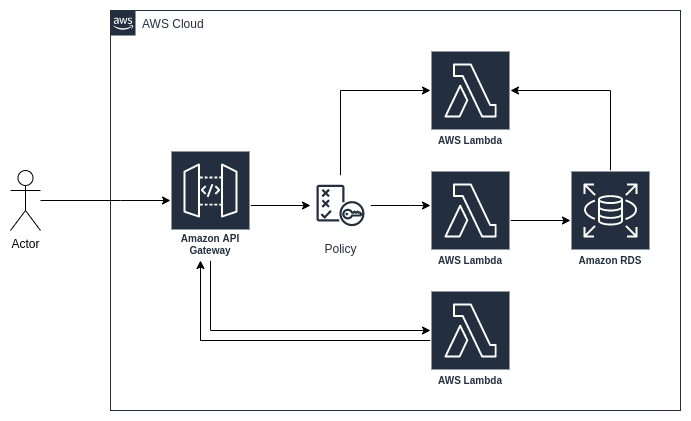

# super-duper-adventure

This code is not production ready.

The intent of this repo is to setup using an IaC (Terraform), an AWS infrastructure to deploy a Golang service
using 
- AWS Lambda function;
- AWS API Gateway;
- AWS Cloudwatch;
- AWS RDS

Logs are stored on an Elasticsearch db.

# architectural-draw



# execute the hypothetical not working script
If this infrastructure worked I'd say (supposing you were on linux with amd64 architecture):

Compile main functions to start lambdas:
```
GOOS=linux GOARCH=amd64 CGO_ENALBED=0 go build -o ./target/post -ldflags '-w' ./lambda/postTask/main.go
GOOS=linux GOARCH=amd64 CGO_ENALBED=0 go build -o ./target/get -ldflags '-w' ./lambda/getTask/main.go
GOOS=linux GOARCH=amd64 CGO_ENALBED=0 go build -o ./target/auth -ldflags '-w' ./lambda/auth/main.go
```

Run terraform:
```
terraform init
terraform plan
terraform apply
```

Make your tests with postman or curl to the generated endpoint (you'll see it as terraform output)

| HTTP Verb | PATH   | Action                                                                                                                                |
|-----------|--------|---------------------------------------------------------------------------------------------------------------------------------------|
| GET       | /tasks | get all tasks in the database table                                                                                                   |
| POST      | /task  | insert new task in the database table with the task format

a task follows the following structure:

```
package model

type Task struct {
	Name        string `json:"name"`
	Description string `json:"description"`
	Status      string `json:"status"`
}
```
