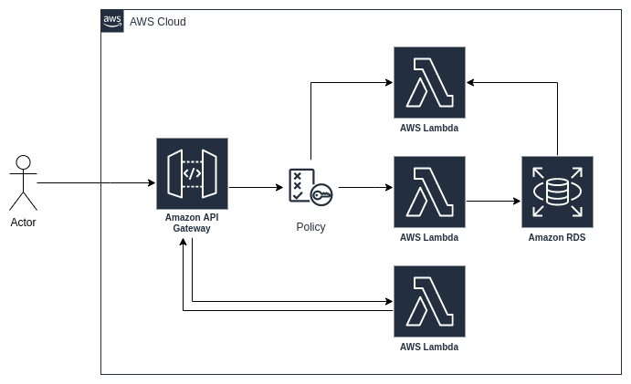

# super-duper-adventure

This code is not production ready.

The intent of this repo is to setup using an IaC (Terraform), an AWS infrastructure to deploy a Golang service
using 
[ ] AWS Lambda function;
[ ] AWS API Gateway;
[ ] AWS Cloudwatch;
[ ] AWS RDS

Logs are stored on an Elasticsearch db.

# architectural-draw

